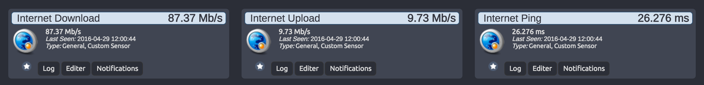
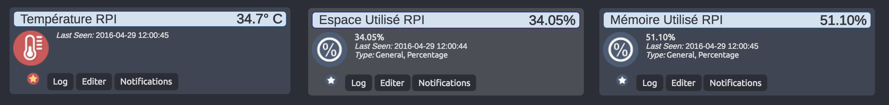
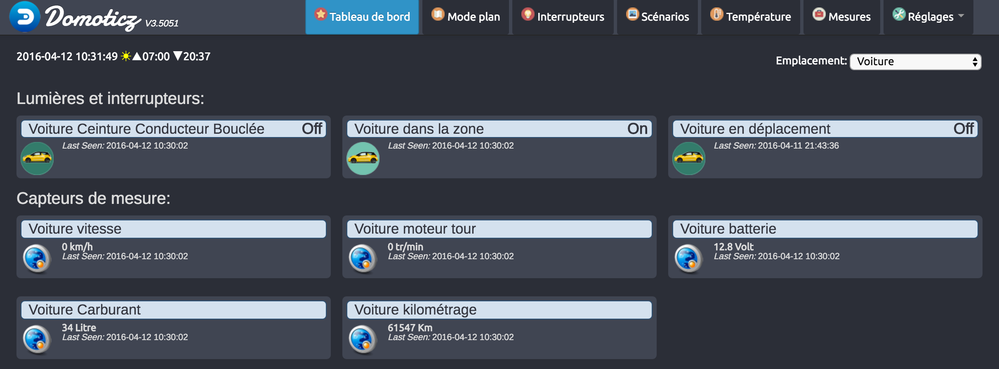

# Scripts list

### My crontab list

```crontab
#Every hours
0 */1 * * * /usr/bin/php5 /home/pi/domoticz_scripts/internet-stat-domoticz-php/index.php

#Every 10 minutes
*/10 * * * * /usr/bin/php5 /home/pi/domoticz_scripts/raspberry-pi-stat-domoticz-php/index.php

#Car data every 6 minutes (Why 6 ? I don't know...)
*/6 * * * * /usr/bin/php5 /home/pi/domoticz_scripts/xee-car-data-to-domoticz-php/xee.php
```

## Internet state
Download, Upload state in Domoticz.



## Raspberry state
Display Raspberry Pi state in Domoticz (CPU,RAM,Temperature...).



## Notice public IP change
Notice user public IP change, notice method : mail, sms, and Domoticz custom or text widget.

## Notice SMS plugin Domoticz
Use Free Mobile API to notice user from custom text in parameter.

## Xee car data to Domoticz
Retrieve information from your precious Xee case and send them to Domoticz !



## Liens
[Boîtier Xee](http://www.amazon.fr/gp/product/B01AIE4CHE/ref=as_li_tl?ie=UTF8&camp=1642&creative=6746&creativeASIN=B01AIE4CHE&linkCode=as2&tag=aureli-21)<br />
[Raspberry Pi 3] (http://www.amazon.fr/gp/product/B01CCOXV34/ref=as_li_tl?ie=UTF8&camp=1642&creative=19458&creativeASIN=B01CCOXV34&linkCode=as2&tag=aureli-21)<br />
[Xee Développeur](https://developer.xee.com/)<br />
[Domoticz](https://domoticz.com/)<br />

# TODO

- [ ] News scripts

### Notice public IP change

- [ ] Mail Notification
- [ ] Free Mobile SMS Notification
- [ ] Send new IP to Domoticz Widget

### Notice SMS plugin Domoticz

### Internet state

### Xee cars data to Domoticz

- [X] Get data and send to Domoticz
- [ ] Select car id
- [ ] Send multiple cars data
- [ ] Send road list
- [ ] Get Token by web interface
