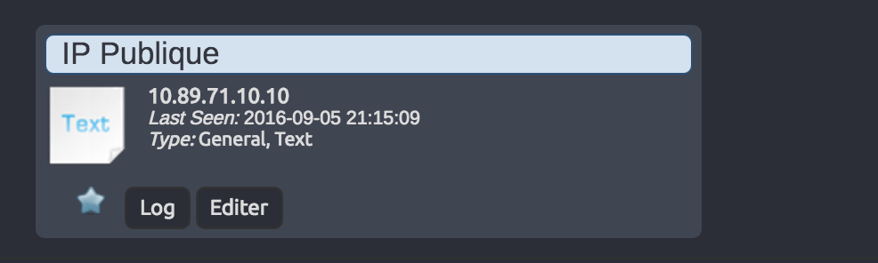

# Scripts list for Domoticz

All script are in PHP and Python.

Developments are underway ! :D

### My crontab list

```crontab

#Every hours
0 */1 * * * /usr/bin/php5 /home/pi/Domoticz_Scripts/internet-stat-domoticz-php/index.php

#Every 10 minutes
*/10 * * * * /usr/bin/php5 /home/pi/Domoticz_Scripts/raspberry-pi-stat-domoticz-php/index.php

#Car data every 6 minutes (Why 6 ? I don't know... Don't forget data=domoticz parameter)
*/6 * * * * /usr/bin/php5 /home/pi/Domoticz_Scripts/xee-car-data-to-domoticz-php/xee.php  data=domoticz

#Notice plublic ip change every 5 minutes
*/5 * * * * /usr/bin/php5 /home/pi/Domoticz_Scripts/notice-public-ip-change-php/index.php

#Get Rain probabillity every 10 minutes
*/10 * * * * /usr/bin/php5 /home/pi/Domoticz_Scripts/get_rain_probability-php/index.php

```

## Prerequisites

````
#install apache for get xee token
sudo apt-get install apache2 -y
#install php because cron are php script ;)
sudo apt-get install php5 libapache2-mod-php5 php5-curl -y
#test install 
curl 127.0.0.1
#return somethink like : <!DOCTYPE html PUBLIC "-//W3C//DTD XHTML 1.0 Transitional//EN" "http://www.w3.org/TR/xhtml1/DTD/xhtml1-transitional.dtd"
#add www-data permission to Domoticz_Scripts folder
sudo chown -R www-data /home/pi/Domoticz_Scripts/
````

## Internet state
Download, Upload state in Domoticz.

[](https://github.com/T3kstiil3/Domoticz_Scripts/tree/master/internet-stat-domoticz-php)

## Raspberry state
Display Raspberry Pi state in Domoticz (CPU,RAM,Temperature...).

[](https://github.com/T3kstiil3/Domoticz_Scripts/tree/master/raspberry-pi-stat-domoticz-php)

## Notice public IP change
Notice user public IP change, notice method : mail, sms, and Domoticz custom or text widget.



## Notice SMS plugin Domoticz
Use Free Mobile API to notice user from custom text in parameter.

## Xee car data to Domoticz
Retrieve information from your precious Xee case and send them to Domoticz !


## Liens
[Boîtier Xee](http://www.amazon.fr/gp/product/B01AIE4CHE/ref=as_li_tl?ie=UTF8&camp=1642&creative=6746&creativeASIN=B01AIE4CHE&linkCode=as2&tag=aureli-21)<br />
[Raspberry Pi 3] (http://www.amazon.fr/gp/product/B01CCOXV34/ref=as_li_tl?ie=UTF8&camp=1642&creative=19458&creativeASIN=B01CCOXV34&linkCode=as2&tag=aureli-21)<br />
[Xee Développeur](https://developer.xee.com/)<br />
[Domoticz](https://domoticz.com/)<br />

# TODO

- [ ] Web interface for manage all scripts and configs
- [ ] News scripts

### Notice public IP change

- [ ] Mail Notification
- [ ] Free Mobile SMS Notification
- [ ] Send new IP to Domoticz Widget

### Xee cars data to Domoticz

- [X] Get data and send to Domoticz
- [ ] Tuto config first start
- [ ] Select car id
- [ ] Send multiple cars data
- [ ] Send road list
- [ ] Get Token by web interface
