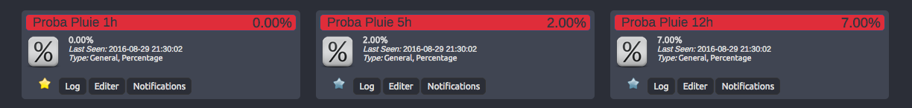

# Notice Publique IP Change

Envoyer les prévisions de pluie à Domoticz. Attention de ne pas dépasser le quota de l'API.
Pour ma part, le cron s'effectue toutes les 10 minutes.



# Configurations

config.json
```json
{
  "country":"FRANCE",
  "apikey" : "123456789ddq5678tto",
  "town": "LILLE",
  "lang" : "FR",
  "IDX_1h" : 200,
  "IDX_5h" : 201,
  "IDX_12h" : 202,
  "IDX_24h" : 203,
  "domoticz_url" : "127.0.0.1:8080"
}
```

# Liens
[Raspberry Pi 3] (http://www.amazon.fr/gp/product/B01CCOXV34/ref=as_li_tl?ie=UTF8&camp=1642&creative=19458&creativeASIN=B01CCOXV34&linkCode=as2&tag=aureli-21)<br />
[Domoticz](https://domoticz.com/)<br />

# TODO
- [ ] Envoi a domoticz
