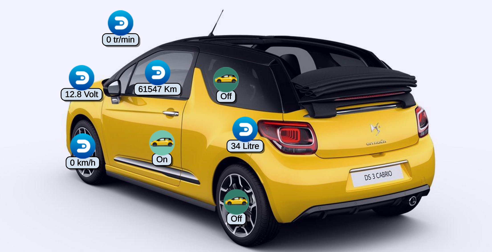

# xee-car-data-to-domoticz-php

Récupérer les informations de votre voiture grâce au boîtier Xee et envoyez-les vers Domoticz !

# Aperçu




# Informations

- Première utilisation ? Lancer le script depuis un serveur web pour récupérer le token Xee
- Le token est enregistré dans le fichier token.txt
- Le script utilise le token ou fait la demande d'un nouveau token si celui-ci est expiré automatiquement grâce au refresh_token
- Il est nécessaire de créer un compte développeur sur https://developer.xee.com/ et de créer une application
- Renseigner les informations de l'application dans un fichier xee_conf.json sous cette forme :

```json
{
  "Client_Id" : "clientid",
  "Client_secret" : "clientsecret",
  "domoticz_url" : "127.0.0.1:8080",
  "garage_lat" : 52.626142,
  "garage_lng" : 1.032489,
  "garage_radis_size" : 0.7
}

```

- Modifier le script avec vos informations
	- Client id
	- Client secret
	- Domoticz Url
	- ...
- Les informations de la première voiture sont envoyées vers domoticz
- Il est nécessaire de créer des custom sensor ou autres dans domoticz pour les afficher

- Nouveau paramètre dans l'url pour utiliser le script comme "api" -> ?data=
 - ?data=domoticz envoie les données vers domoticz
 - Retourne un json
 	- ?data=car renvoie les dernières informations de la voiture
 	- ?data=trips renvoie la liste des derniers trajets
 	- ?data=trip&trip_id=45678905678456789 renvoie les données de la voiture sur un trajet spécifique

Fonctionntalités utilisées pour mon miroir connecté https://github.com/T3kstiil3/The_Mirror

# Liens
[Boîtier Xee](http://www.amazon.fr/gp/product/B01AIE4CHE/ref=as_li_tl?ie=UTF8&camp=1642&creative=6746&creativeASIN=B01AIE4CHE&linkCode=as2&tag=aureli-21)<br />
[Raspberry Pi 3] (http://www.amazon.fr/gp/product/B01CCOXV34/ref=as_li_tl?ie=UTF8&camp=1642&creative=19458&creativeASIN=B01CCOXV34&linkCode=as2&tag=aureli-21)<br />
[Xee Développeur](https://developer.xee.com/)<br />
[Domoticz](https://domoticz.com/)<br />

# TODO
- [x] V3 de l'api Xee
- [x] Utiliser le script sous forme d'api local
- [ ] Commenter le code
- [ ] Gérer plusieurs véhicules
